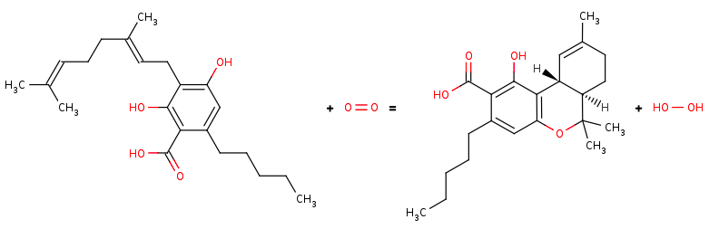
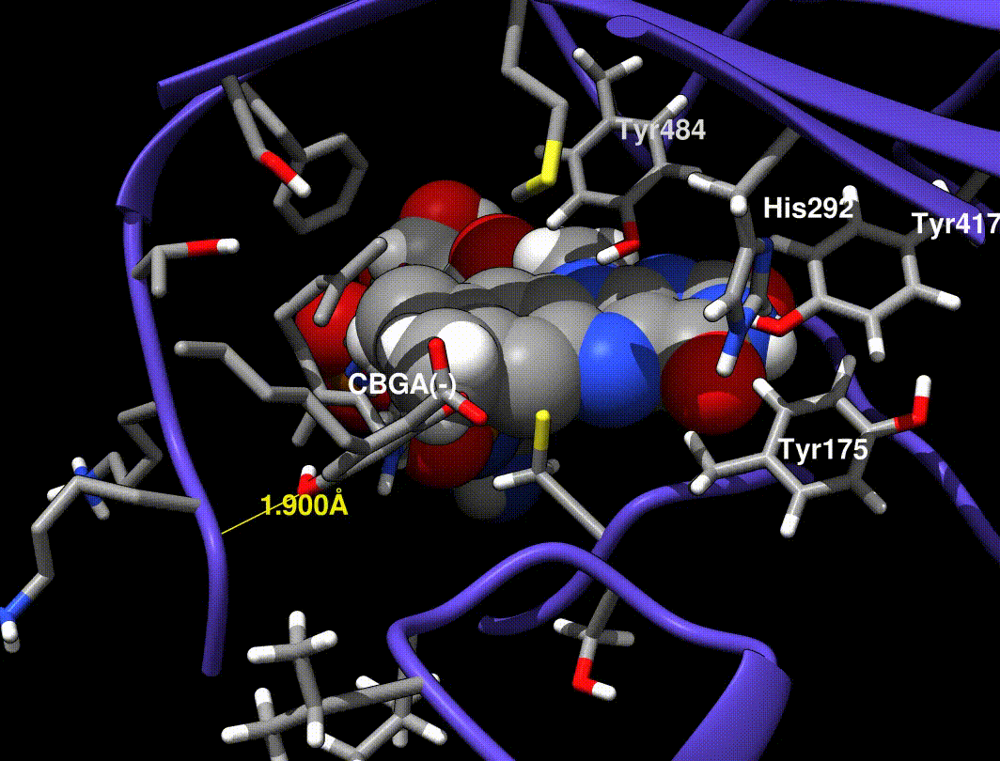
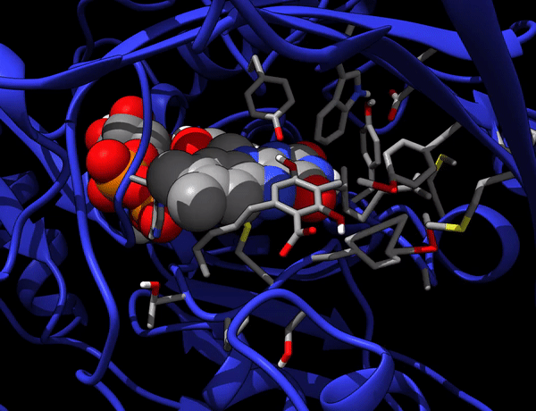

# About

## Propsed FAD-dependent Oxidative Cyclization

1. Hydride transfer to FAD forms a tertiary carbocation that arranges the ring closure
2. Tyr484 abstracts a proton from CBGA to form an alkoxide nucleophile

- Mutations at Tyr484 abolish catalysis (catalytic base)
- Mutations at His114 and Cys176 abolish catalysis (covalent FAD bound residues)
- Mutations at Tyr417 and His292 greatly reduce Kcat (non-covalent FAD bound residues)

    
    

        BRENDA:
        <a href='https://www.brenda-enzymes.org/enzyme.php?ecno=1.21.3.7'>
            EC 1.21.3.7
        </a>
    

    
    

        DOI:
        <a href='https://doi.org/10.1007/978-3-319-54564-6_8'>
             10.1007/978-3-319-54564-6_8
        </a>
    

    
    
 
        Active-site + FAD + substrate
    

### TODO

    
    

        

            Combined rendering of all minimization and equilibration runs descibed in <a href='https://github.com/Chebuu/3VTE-model/tree/master/exp.00/01-Assembly.ipynb'>exp.00/01-Assembly.ipynb</a>. CBGA(-) (1.61 SwissDock pose 1.61) is shown at the entance of the active site (backbone H-bond in green, FAD as space-fill). 
        

    

In [exp.01], a minimized CBGA(-) conformer was placed by hand in the active site and run through the same minimization steps in [exp.00]. More importantly, Tyr484 was replaced with a tyrosine phenolate (charge -1.0) in the QC runs only (the phenol was used in minimization runs). 

A Tyr484 phenolate is proposed to be the catalytic base, but phenolate is very unstable, so I find it implausible that this species exists without interaction from neighboring side chains. 

    
    

        

            Short clip of MD run from [exp.01] before a segfault broke it. 
        

    

### Add model components
- O2
- NAG
- HOOH

### Write system temp/energy during equilibration
- I'm unsure if the temp of the system in the amber sims

### Fix nonstandard residues
- Curently all His residues are HIE (except FAD-bound His)

### Fix FAD linkage residues
- Bound His114 is cuently parameterized as HID
    - Might actually be an OK approximation
    - Adding some params from 4-HNE might be best
        - Haven't checked for differences compared to HID
        - http://research.bmh.manchester.ac.uk/bryce/amber
            - [FRCMOD](http://personalpages.manchester.ac.uk/staff/Richard.Bryce/amber/pro/u01.frcmod)
            - [OFF](https://personalpages.manchester.ac.uk/staff/Richard.Bryce/amber/pro/u01.lib)
- I dont think Cys176 needs to be CYX
    - I think CYX just tells Amber to delete the proton
        - No noticeable problems with CYS so far 

### Fix protons
- Unsure of His114 protonation state
    - It curently exists as HID (neutral)
- Protonate His292
    - Replace with HIP
- Protonations should reflect:
    - pH 5.0
    - Expected H-bonds
