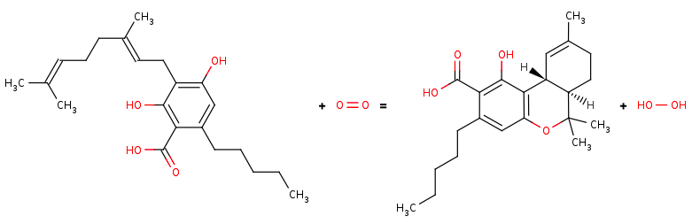
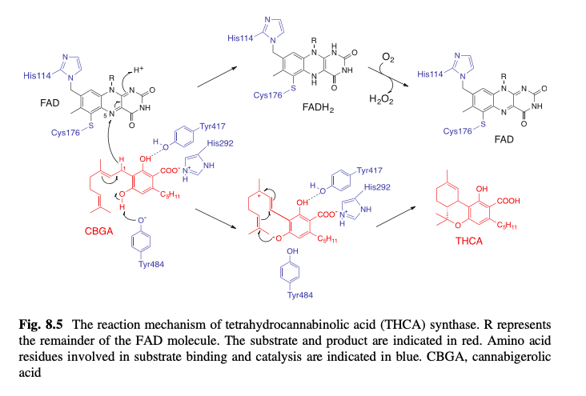

# TODO:

### Add model components
- O2
- NAG
- HOOH
- Ions

### Pick more approx. CBGA pose
- Current pose has few clashes but is far from asite

### Add impropers for FAD-His-Cys
- Use the LigParGen parameters

### Fix nonstandard residues
- Curently all His residues are HIE including His114
- I think Cys176 needs to be CYX if it's ligand bound

### Fix protons
- Protonate His292
- Deprotonate Tyr484 
- Protonation states should reflect H-bonds
    - [View ligand interaction](https://www.rcsb.org/3d-view/3VTE?preset=ligandInteraction&sele=FAD)
    
### Replace the CHARMM-GUI 3VTE model
- Use the [3VTE PDB-REDO](https://pdb-redo.eu/db/3vte) model
- Either delete the S-S fragments or add the crosslinks
    - Filling with modeled loops is a bad idea

# Propsed FAD-dependent Oxidative Cyclization 
Tyr484 abstracts a proton from CBGA to form an alkoxide nucleophile.        
FAD accepts a hydride to form a tertiary carbocation that arranges the ring closure.  
- Mutations at Tyr484 abolish catalysis (catalytic base)
- Mutations at His114 and Cys176 abolish catalysis (covalent FAD bound residues)
- Mutations at Tyr417 and His292 greatly reduce Kcat (non-covalent FAD bound residues)

    
    

        BRENDA:
        <a href='https://www.brenda-enzymes.org/enzyme.php?ecno=1.21.3.7'>
            EC 1.21.3.7
        </a>
    

    
    

        DOI:
        <a href='https://doi.org/10.1007/978-3-319-54564-6_8'>
             10.1007/978-3-319-54564-6_8
        </a>
    

    
    
 
        Active-site + FAD + substrate
    

