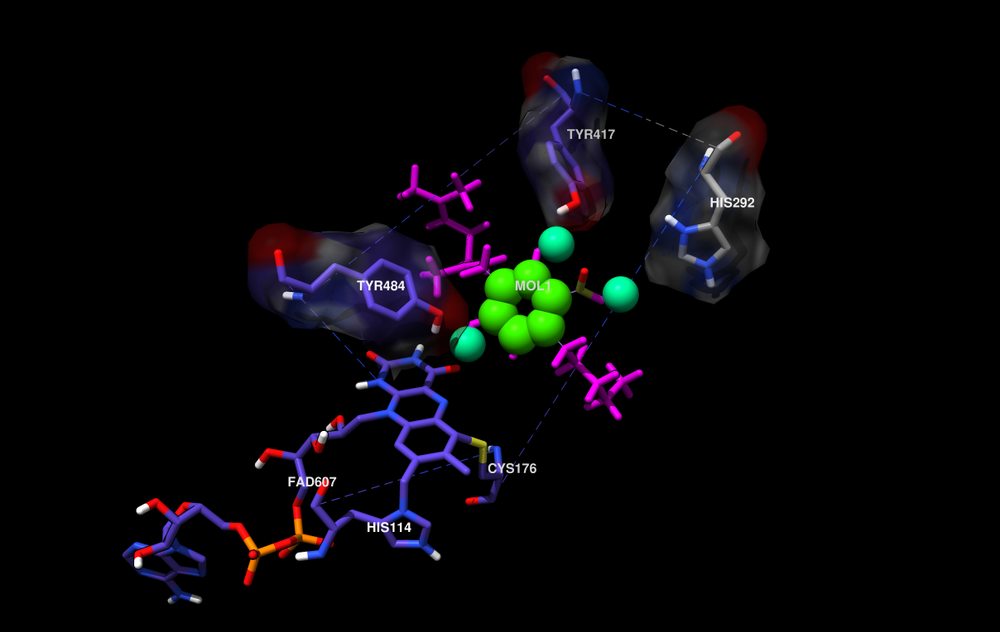

# TODO:

### Summary of Problems
- The docked CBGA(-) pose chosen for [exp.00] doesn't move into the active site in sub-nanosecond MD runs because of an H-bond to the backbone, but the trajectory is dircted towards the active site with a lengthening H-bond, so longer run-time might eventually show CBGA(-) dock in the right pose. The protein was also restrained to reduce computational load, but removing the restaints on active-site residues will likely facilitate docking.

    
    

        

            Combined rendering of all minimization and equilibration runs descibed in <a href='https://github.com/Chebuu/3VTE-model/tree/master/exp.00/01-Assembly.ipynb'>exp.00/01-Assembly.ipynb</a>. CBGA(-) (1.61 SwissDock pose 1.61) is shown at the entance of the active site (backbone H-bond in green, FAD as space-fill). 
        

    

- In [exp.01], a minimized CBGA(-) conformer was placed by hand in the active site and run through the same minimization steps in [exp.00]. More importantly, Tyr484 was replaced with a tyrosine phenolate (charge -1.0) in the QMMM runs only (the phenol was used in minimization runs). Obviously, a phenolate is *extremely* unstable, and I think it's causing the crazy trajectories seen in the QMMM runs. A Tyr484 phenolate is proposed to be the catalytic base, but I find it implausible that this species exists as a stable reactant. Or maybe I'm just naive, and this species is simply drawn for convenience, while the true species is implied. I think its much more likely that, instead of a phenolate, an interaction between Tyr484 and a nearby His or Trp nitrogen induces the Tyr484 phenol to act as a Lewis base. 
    - Ultimately I just need to dig through the liteature to understand the mechanisms by which Tyr bases are formed and catalyze reactions.
    - Update: I increased the run times and now sander actually segfaults during solvent minimization and [reports](exp.01/em.water.log) incalculable energy and Van der Waals forces.

    
    

        

            Short clip of MD run from [exp.01] (before the segfault bug) showing runaway trajectories (Tyr484 phenolate is top center). Unfortunately, I cleared the corresponding logs for this run, but I think the video clearly shows the phenolate is the underlying cause. 
        

    

### Add model components
- O2
- NAG
- HOOH
- Ions

### Write system temp/energy during equilibration
- I'm unsure if the temp of the system in this sim

### Add impropers for FAD-His-Cys
- Use the LigParGen parameters

### Fix nonstandard residues
- Curently all His residues are HIE including His114

### Fix FAD linkage residues
- The LigParGen params for FAD include His114 and Cys176
    - Res atom types would need to match
        - Would res type need changed?
- Bound His114 is cuently parameterized as HID
    - Might actually be an OK approximation
    - Adding some params from 4-HNE might be best
        - Haven't checked for differences compared to HID
        - http://research.bmh.manchester.ac.uk/bryce/amber
            - [FRCMOD](http://personalpages.manchester.ac.uk/staff/Richard.Bryce/amber/pro/u01.frcmod)
            - [OFF](https://personalpages.manchester.ac.uk/staff/Richard.Bryce/amber/pro/u01.lib)
- I dont think Cys176 needs to be CYX
    - I think CYX just tells Amber to delete the proton
        - No noticeable problems with CYS so far 

### Fix protons
- Unsure of His114 protonation state
    - It curently exists as HID (neutral)
- Protonate His292
    - Replace with HIP
- Protonations should reflect:
    - pH 5.0
    - Expected H-bonds

# Propsed FAD-dependent Oxidative Cyclization

1. Hydride transfer to FAD forms a tertiary carbocation that arranges the ring closure
2. Tyr484 abstracts a proton from CBGA to form an alkoxide nucleophile

- Mutations at Tyr484 abolish catalysis (catalytic base)
- Mutations at His114 and Cys176 abolish catalysis (covalent FAD bound residues)
- Mutations at Tyr417 and His292 greatly reduce Kcat (non-covalent FAD bound residues)

    
    

        BRENDA:
        <a href='https://www.brenda-enzymes.org/enzyme.php?ecno=1.21.3.7'>
            EC 1.21.3.7
        </a>
    

    
    

        DOI:
        <a href='https://doi.org/10.1007/978-3-319-54564-6_8'>
             10.1007/978-3-319-54564-6_8
        </a>
    

    
    
 
        Active-site + FAD + substrate
    

